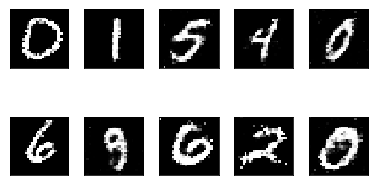
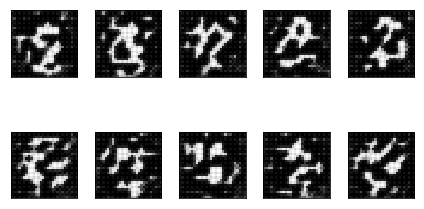
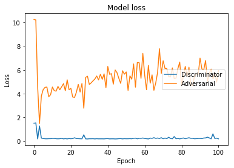
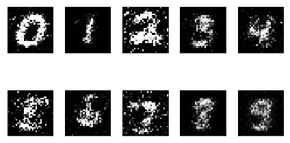
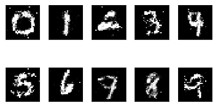
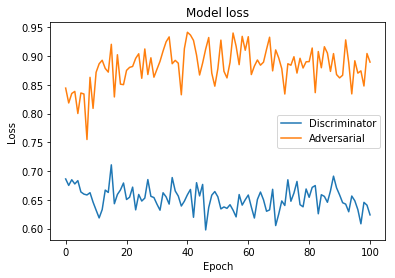
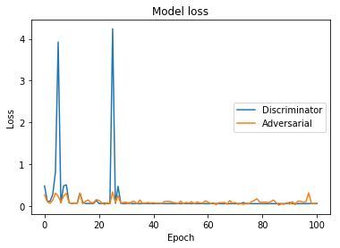
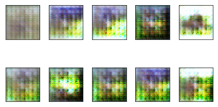
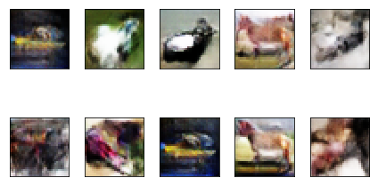
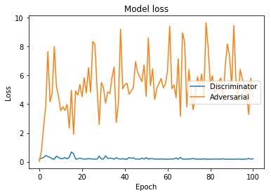

# Generative Adversarial Networks

This repository presents the **basic notions** that involve the concept of Generative Adversarial Networks.

> *"...the most interesting idea in the last 10 years in ML". Yann LeCun*

## Definition

[Generative Adversarial Networks or GANs](https://arxiv.org/abs/1406.2661) is a framework proposed by [Ian Goodfellow](http://www.iangoodfellow.com/), Yoshua Bengio and others in 2014.

GANs are composed of two models, represented by neural networks:
* The first model is called a **Generator** and it aims to generate new data similar to the expected one. 
* The second model is named the **Discriminator** and it aims to recognize if an input data is ‘real’ — belongs to the original dataset — or if it is ‘fake’ — generated by a forger.

## Models

Definition and training some models with MNIST and CIFAR-10 datasets.

### MNIST dataset

* [GAN - MNIST](https://github.com/mafda/generative_adversarial_networks_101/blob/master/src/01_GAN_MNIST.ipynb)
* [DCGAN - MNIST](https://github.com/mafda/generative_adversarial_networks_101/blob/master/src/02_DCGAN_MNIST.ipynb)
* [CGAN - MNIST](https://github.com/mafda/generative_adversarial_networks_101/blob/master/src/03_CGAN_MNIST.ipynb)
* [CCGAN - MNIST](https://github.com/mafda/generative_adversarial_networks_101/blob/master/src/04_CCGAN_MNIST.ipynb)

### CIFAR-10 dataset

* [DCGAN - CIFAR10](https://github.com/mafda/generative_adversarial_networks_101/blob/master/src/02_DCGAN_CIFAR10.ipynb)

## Results

Training models with Keras and TensorFlow

### MNIST dataset

#### Generative Adversarial Networks - GANs
A GANs implementation using fully connected layers. [Code.](https://github.com/mafda/generative_adversarial_networks_101/blob/master/src/01_GAN_MNIST.ipynb)

| Epoch 00 | Epoch 100 | Loss |
|----------|-----------|------|
|  | | |

#### Deep Convolutional Generative Adversarial Networks - DCGANs
A DCGANs implementation using the transposed convolution technique. [Code.](https://github.com/mafda/generative_adversarial_networks_101/blob/master/src/02_DCGAN_MNIST.ipynb)

| Epoch 00 | Epoch 100 | Loss |
|----------|-----------|------|
|  | | |

#### Conditional Generative Adversarial Nets - CGANs
A CGANs implementation using fully connected layers and embedding layers. [Code.](https://github.com/mafda/generative_adversarial_networks_101/blob/master/src/03_CGAN_MNIST.ipynb)

| Epoch 00 | Epoch 100 | Loss |
|----------|-----------|------|
|  | | |

#### Context-Conditional Generative Adversarial Networks - CCGANs
A CCGANs implementation using U-Net and convolutional neural network. [Code.](https://github.com/mafda/generative_adversarial_networks_101/blob/master/src/04_CCGAN_MNIST.ipynb)

| Epoch 00 | Epoch 100 | Loss |
|----------|-----------|------|
|  | | |

### CIFAR-10 dataset

#### Deep Convolutional Generative Adversarial Networks - DCGANs
A DCGANs implementation using the transposed convolution technique. [Code.](https://github.com/mafda/generative_adversarial_networks_101/blob/master/src/02_DCGAN_CIFAR10.ipynb)

| Epoch 00 | Epoch 100 | Loss |
|----------|-----------|------|
|  | | |

---

## References

* [Generative Adversarial Networks or GANs](https://arxiv.org/abs/1406.2661)
* [THE MNIST DATABASE of handwritten digits](http://yann.lecun.com/exdb/mnist/)
* [The CIFAR-10 dataset](https://www.cs.toronto.edu/%7Ekriz/cifar.html)

